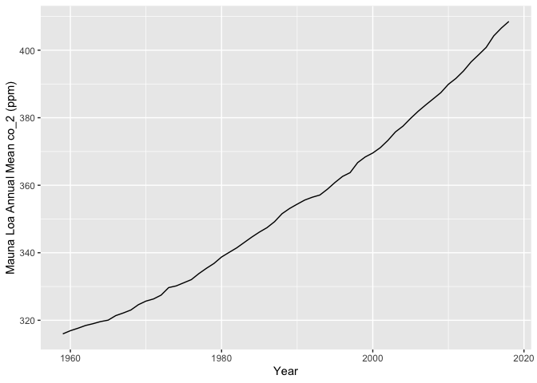

Carbon Dioxide Concentrations at Mona Loa Observatory
================
Zolal
10/17/2019

## Annual Mean Carbon Dioxide Concentrations 1959-Present

<!-- -->

## Top Five Annual Mean Carbon Dioxide Concentrations at Mona Loa

| year |   mean |
| ---: | -----: |
| 2018 | 408.52 |
| 2017 | 406.55 |
| 2016 | 404.24 |
| 2015 | 400.83 |
| 2014 | 398.65 |
